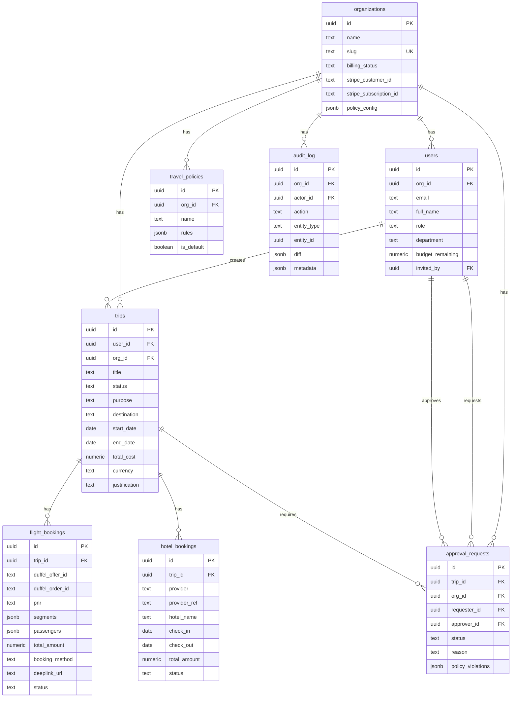

# Data Model

## ER Diagram



## JSONB Schemas

### travel_policies.rules
```json
{
  "max_flight_price": 500,
  "cabin_class": ["economy"],
  "advance_booking_days": 7,
  "hotel_nightly_cap": 200,
  "requires_approval_above": 1000,
  "allowed_airlines": [],
  "blacklisted_destinations": []
}
```

### flight_bookings.segments
```json
[{
  "origin": "LHR",
  "destination": "JFK",
  "departure": "2024-03-15T08:00:00Z",
  "arrival": "2024-03-15T11:00:00Z",
  "carrier": "British Airways",
  "flightNumber": "BA117",
  "cabin": "economy",
  "duration": 480
}]
```
